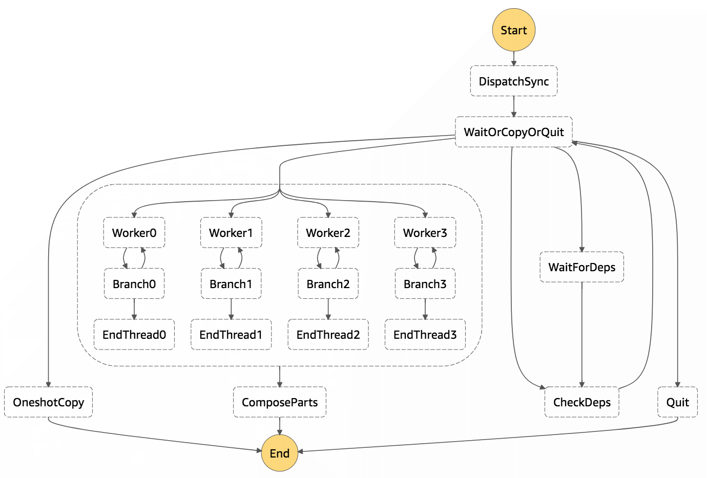

# DSS sync daemon

Event handlers in the dss-sync daemon use utility functions in
[dss.events.handlers.sync](../../dss/events/handlers/sync.py).

Events are first received from object storage:

* S3 invokes the `dss-sync-sfn` Lambda via an S3 event notification forwarded via SQS (`app.py:launch_from_s3_event()`).

* GS invokes the `dss-gs-copy-sfn` GCF via a PubSub event notification
  (`/daemons/dss-gs-event-relay-python/main.py:dss_gs_event_relay()`). The GCF then forwards the event to the
  `dss-sync-sfn` Lambda via SQS (`app.py:launch_from_forwarded_event()`).

If the event concerns an object that already exists in the destination bucket, the process stops. Otherwise, the sync
step function is started (defined in `app.py`):

The state function starts with the `DispatchSync` state (`app.py:dispatch_sync()`). This state processes the storage
event notification and orchestrates the rest of the copying:

- If the notification is for a file blob:
    - If the blob is under the one-shot threshold, sends the state machine to `OneshotCopy`, which immediately copies
    it and exits the state machine.
    - Otherwise, configures the state machine to run the threadpool (copy blob parts) and closer (compose the copy).
- Otherwise, enters a loop between `WaitForDeps` (configurable sleep state) and `CheckDeps`, which checks if all
  referenced entities are already copied to the destination:
  - For a file manifest, checks that the blob is there.
  - For a bundle manifest, checks that file manifests for all files in the bundle are there.
  - For a collection manifest, checks that all collection contents are there.
  If the checks fail, `CheckDeps` sends the state machine to sleep in `WaitForDeps` for 8 seconds, then try again.
  If the checks succeed:
    - If the blob is under the one-shot threshold, sends the state machine to `OneshotCopy`, which immediately copies
      it and exits the state machine.
    - Otherwise, configures the state machine to run the threadpool (copy blob parts) and closer (compose the copy).

The one-shot threshold is FIXME.

All the event handler and SFN state lambdas above are actually the same lambda distribution (dss-sync), called via
different entry points from different event notifications, orchestrated by the domovoi library.
